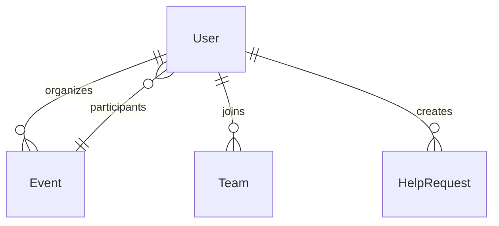

# 💖 Hands-On Volunteering Platform

A platform to discover and join meaningful social impact opportunities. Users can **create & join volunteer events, request community help, form teams, and track their contributions**.  

---

## 📈 **Technologies Used**
- **Frontend:** React.js, Tailwind CSS  
- **Backend:** Node.js, Express.js, Sequelize  
- **Database:** PostgreSQL  
- **Authentication:** JWT (JSON Web Tokens)  
- **Deployment:** Netlify (Frontend), Render (Backend)  

---

## 📈 **Key Features**
✅ **User Authentication:** Register & login securely with JWT  
✅ **Event Management:** Create, list, and join volunteer events  
✅ **Community Help Requests:** Post and respond to help requests  
✅ **Team Collaboration:** Form and join teams for social initiatives  
✅ **Profile & Contributions:** Track past events and activities  

---

## 📈 **Database Schema**


---

## 📈 **Setup Instructions**
### **1️⃣ Clone the Repository**
```sh
git clone https://github.com/YOUR_GITHUB_USERNAME/hands-on-volunteering-platform.git
cd hands-on-volunteering-platform
```
### **2️⃣ Backend Setup**
```sh
cd backend
npm install
```
- Create a `.env` file:
```
DB_NAME=hands_on_volunteering
DB_USER=postgres
DB_PASSWORD=your_database_password
DB_HOST=localhost
DB_DIALECT=postgres
JWT_SECRET=your_jwt_secret
```
- Start the backend:
```sh
node server.js
```

### **3️⃣ Frontend Setup**
```sh
cd ../frontend
npm install
npm start
```

---

## 📈 **API Documentation**
### **🟢 User Authentication**
#### **1️⃣ Register User**
- **Endpoint:** `POST /api/auth/register`
- **Body:**
```json
{
  "name": "John Doe",
  "email": "john@example.com",
  "password": "123456"
}
```
- **Response:**
```json
{
  "msg": "User registered successfully",
  "user": { "id": 1, "name": "John Doe" }
}
```

#### **2️⃣ Login User**
- **Endpoint:** `POST /api/auth/login`
- **Body:**
```json
{
  "email": "john@example.com",
  "password": "123456"
}
```
- **Response:**
```json
{
  "token": "eyJhbGciOiJIUzI1NiIsInR...",
  "user": { "id": 1, "name": "John Doe" }
}
```

### **🟢 Event Management**
#### **1️⃣ Create an Event**
- **Endpoint:** `POST /api/events/create`
- **Body:**
```json
{
  "title": "Tree Plantation Drive",
  "description": "Join us in planting trees!",
  "date": "2024-03-15",
  "location": "Central Park",
  "category": "Environment",
  "organizerId": 1
}
```

#### **2️⃣ Get All Events**
- **Endpoint:** `GET /api/events/list`
- **Response:**
```json
[
  {
    "id": 1,
    "title": "Tree Plantation Drive",
    "location": "Central Park"
  }
]
```


## 📈 **Running the Project**
### **1️⃣ Run Locally**
```sh
cd backend && node server.js
cd frontend && npm start
```

### **2️⃣ Deploy on Render & Netlify**
- **Backend (Render):** Connect GitHub & Deploy  
- **Frontend (Netlify):** Connect GitHub & Deploy  

---

## 📈 **Contributing**
We welcome contributions! To contribute:  
1. Fork the repository  
2. Create a new branch (`git checkout -b feature/add-new-feature`)  
3. Commit changes (`git commit -m "feat: add new feature"`)  
4. Push to GitHub (`git push origin feature/add-new-feature`)  
5. Submit a Pull Request  

---

## 📈 **License**
This project is open-source and available under the [MIT License](LICENSE).  
```

